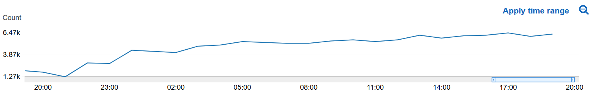

# Object Tracker

This Sample Application can train a reinforcement learning model to make a TurtleBot WafflePi to follow a TurtleBot burger. It can then deploy and run the learned model to a real-life TurtleBot WafflePi via AWS RoboMaker.

_RoboMaker sample applications include third-party software licensed under open-source licenses and is provided for demonstration purposes only. Incorporation or use of RoboMaker sample applications in connection with your production workloads or a commercial products or devices may affect your legal rights or obligations under the applicable open-source licenses. Source code information can be found [here](https://s3.console.aws.amazon.com/s3/buckets/robomaker-applications-us-east-1-72fc243f9355/object-tracker/?region=us-east-1)._

Keywords: Reinforcement learning, AWS, RoboMaker


## Requirements

- ROS Kinetic (optional) - To run the simulation locally. Other distributions of ROS may work, however they have not been tested
- Gazebo (optional) - To run the simulation locally
- TurtleBot WafflePi (optional) - To run the trained reinforcement learning model in the real world
- An AWS S3 bucket - To store the trained reinforcement learning model
- AWS RoboMaker - To run the simulation and to deploy the trained model to the robot

## AWS Account Setup
  
### AWS Credentials
You will need to create an AWS Account and configure the credentials to be able to communicate with AWS services. You may find [AWS Configuration and Credential Files](https://docs.aws.amazon.com/cli/latest/userguide/cli-config-files.html) helpful.

### AWS Permissions

You can find instructions for creating a new IAM Policy [here](https://docs.aws.amazon.com/IAM/latest/UserGuide/access_policies_create.html#access_policies_create-start). In the JSON tab paste the following policy document:

```
{
  "Version": "2012-10-17",
  "Statement": [
    {
      Action: 's3:ListBucket',
      Effect: 'Allow',
      Resource: [
        Fn.Join('', [ 'arn:aws:s3:::', Fn.Ref(Resources.BundlesBucket) ])
      ]
    },
    {
      Action: [
        's3:Get*',
        's3:List*'
      ],
      Effect: 'Allow',
      Resource: [
        Fn.Join('', [ 'arn:aws:s3:::', Fn.Ref(Resources.BundlesBucket), '/*' ])
      ]
    },
    {
      Action: 's3:Put*',
      Effect: 'Allow',
      Resource: [
        Fn.Join('', [ 'arn:aws:s3:::', Fn.Ref(Resources.BundlesBucket), '/*' ])
      ]
    },
    {
      Action: [
        'logs:CreateLogGroup',
        'logs:CreateLogStream',
        'logs:PutLogEvents',
        'logs:DescribeLogStreams'
      ],
      Effect: 'Allow',
      Resource: [
        Fn.Join(':', [ 'arn:aws:logs', Refs.Region, Refs.AccountId, `log-group:${cwGroupPrefix}*` ])
      ]
    },
    {
      Action: [
        'ec2:CreateNetworkInterfacePermission'
      ],
      Effect: 'Allow',
      Resource: [
        Fn.Join(':', [ 'arn:aws:ec2', Refs.Region, Refs.AccountId, '*' ])
      ]
    },
    {
      Action: [
        'ec2:AssociateRouteTable',
        'ec2:CreateSubnet',
        'ec2:DeleteNetworkInterface',
        'ec2:DeleteSubnet',
        'ec2:DescribeNetworkInterfaces',
        'ec2:DescribeSecurityGroups',
        'ec2:DescribeSubnets',
        'ec2:DescribeVpcs'
      ],
      Effect: 'Allow',
      Resource: '*' // These ec2 commands do not support resource-level permissions
    },
    {
      Action: [
        'cloudwatch:PutMetricData'
      ],
      Effect: 'Allow',
      Resource: '*' // This command does not support resource-level permissions
    },
    {
      Action: [
        's3:DeleteObject'
      ],
      Effect: 'Allow',
      Resource: [ Fn.Join('', [ Fn.GetAtt(Resources.BundlesBucket, 'Arn'), '/', '*' ]) ]
    }
  ]
}
```

## Usage

### Training the model

#### Building the simulation bundle

```bash
cd simulation_ws
rosws update
rosdep install --from-paths src --ignore-src -r -y
colcon build
colcon bundle
```

#### Running the simulation

- MARKOV_PRESET_FILE - Defines the hyperparameters of the reinforcement learning algorithm. This should be set to `object_tracker.py`.
- MODEL_S3_BUCKET - The name of the S3 bucket in which you want to store the trained model.
- MODEL_S3_PREFIX - The path where you want to store the model.
- ROS_AWS_REGION - The region of the S3 bucket in which you want to store the model.

If you are running the simulation outside of RoboMaker, you will also need the following environment variables, which gives the simulation permissions to S3.

- AWS_ACCESS_KEY_ID
- AWS_SECRET_ACCESS_KEY
- AWS_SESSION_TOKEN

Once the environment variables are set, you can run local training using the roslaunch command

```bash
source simulation_ws/install/setup.sh
roslaunch object_tracker_simulation local_training.launch
```

#### Seeing your robot learn

As the reinforcement learning model improves, the reward function will increase. You can see the graph of this reward function at

All -> AWSRoboMakerSimulation -> Metrics with no dimensions -> Metric Name -> ObjectTrackerRewardPerEpisode

You can think of this metric as an indicator into how well your model has been trained. If the graph has plateaus, then your robot has finished learning.



### Evaluating the model

#### Building the simulation bundle

You can reuse the bundle from the training phase again in the simulation phase.

#### Running the simulation

The evaluation phase requires that the same environment variables be set as in the training phase. Once the environment variables are set, you can run
evaluation using the roslaunch command

```bash
source simulation_ws/install/setup.sh
roslaunch object_tracker_robot evaluation.launch
```

### Deploying the model


#### Building the robot bundle

Before you build the robot workspace, you must edit the file `robot_ws/src/object_tracker_robot/config/model_config.yaml` to include the location
of your trained model, as well as the temporary AWS IAM credentials it needs to pull the model. For more information on how to get your AWS
credentials, see [this page](https://docs.aws.amazon.com/general/latest/gr/aws-sec-cred-types.html).

Create a file `/etc/ros/rosdep/custom-rules/object-tracker-rules.yaml` and add the following configuration to it.
```
libjpeg62:
  ubuntu:
    xenial: [libjpeg62]
```

```bash
echo "yaml file:/etc/ros/rosdep/custom-rules/object-tracker-rules.yaml" > /etc/ros/rosdep/sources.list.d/23-object-tracker-rules.list
sudo apt-get update
cd robot_ws
rosdep update
rosdep install --from-paths src --ignore-src -r -y
colcon build
colcon bundle
```

#### Running the model on the TurtleBot

Once the bundle has been created, it can be deployed using RoboMaker. For information about deploying using RoboMaker,
see [this documentation](https://docs.aws.amazon.com/robomaker/latest/dg/gs-deploy.html).

You must also complete the Raspberry Pi camera setup for the TurtleBot WafflePi, outlined
[here](http://emanual.robotis.com/docs/en/platform/turtlebot3/appendix_raspi_cam/#raspberry-pi-camera).

You must run the following command before running the Robot Application on the robot.
```bash
sudo chmod 777 /dev/video0
```

You may also upload and run the bundle manually. Once the bundle has been manually uploaded to the target TurtleBot WafflePi, ssh into the TurtleBot and run

```bash
export BUNDLE_CURRENT_PREFIX=<bundle location>
source $BUNDLE_CURRENT_PREFIX/setup.sh
roslaunch object_tracker_robot/main.launch
```

Your TurtleBot WafflePi should now be track and move towards any other TurtleBot you put in front of it! For the best results, your real-life environment should match
your simulated environment as closely as possible. You can try tweaking your simulated environment by adding randomization, lighting, textures, or even to
have the TurtleBot try to track a different object.

### Troubleshooting

###### The robot does not look like it is training

The training algorithm has two phases. The first is when the reinforcement learning model attempts to navigate the robot towards
its target, while the second is when the algorithm uses the information gained in the first phase to update the model. In the second
phase, no new commands are sent to the TurtleBot, meaning it will appear as if it is stopped, spinning in circles, or drifting off
aimlessly.

## Using this sample with RoboMaker

You first need to install colcon. Python 3.5 or above is required. 

```bash
pip3 install colcon-ros-bundle
```

After colcon is installed you need to build your robot or simulation, then you can bundle with:

```bash
# Bundling Robot Application
cd robot_ws
source install/local_setup.sh
colcon bundle

# Bundling Simulation Application
cd simulation_ws
colcon bundle
```

This produces the artifacts `robot_ws/build/output.tar.gz` and `simulation_ws/build/output.tar.gz` respectively. 
You'll need to upload these to an s3 bucket, then you can use these files to
[create a robot application](https://docs.aws.amazon.com/robomaker/latest/dg/create-robot-application.html),
[create a simulation application](https://docs.aws.amazon.com/robomaker/latest/dg/create-simulation-application.html),
and [create a simulation job](https://docs.aws.amazon.com/robomaker/latest/dg/create-simulation-job.html) in RoboMaker.

## License

Most of this code is licensed under the MIT-0 no-attribution license. However, the sagemaker_rl_agent package is
licensed under Apache 2. See LICENSE.txt for further information.

## How to Contribute

Create issues and pull requests against this Repository on Github
